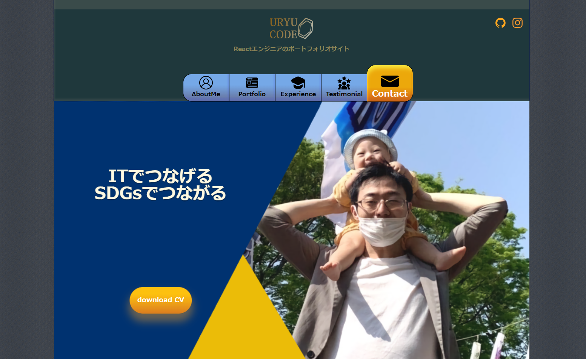

<h1 style="text-align:center;">
エンジニアポートフォリオサイト
</h1>

## App URL
[https://tatsumip.github.io/](https://tatsumip.github.io/)

## サイトの概要
- LP型のポートフォリオサイト
- レシポンシブデザインに対応
- メニュボタン機能あり
- react-routerのLinkタグでページ遷移機能を実装
- reactのswiperでスライダー機能を実装
- reactのEmailJSでメール送信機能を実装

## 特徴
- 開発者の人当たりの良さを、レトロなホテルの内装のイメージに重ねてデザインしてみました。

## 使用技術
- フロントエンド
  - HTML/CSS
  - React
  - emailjs/browser
  - react-scroll
  - swiper
